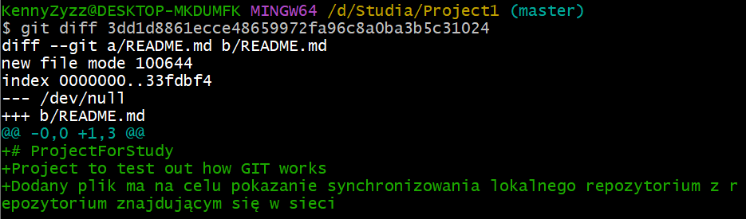

# Added prevoiusly created repository to GitHub site

### Link

[Remote repository](https://github.com/KennyZyzz/ProjectForStudy)

### First push add:

- files created in previouse tasks
  - folders

### Second push add:

- add custom txt file
  - create file by 'touch' command
  - add it to commit
  - push it

## Create README.md file by user interface on GitHub site

- create file
  - create be ui
  - paste custom content
  - synchronize with remote repo by pull changes to local repo

## Checking differences by console

Checking differences after pulling changes from remote repository

